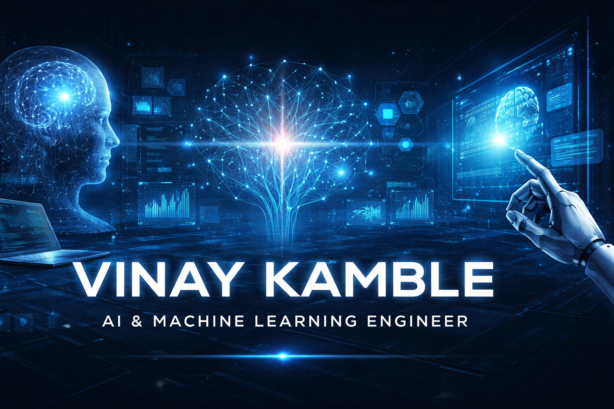

  

<h2> / about me / </h2>

<ul>
  <li>AI/ML engineering student focused on research-driven system design</li>
  <li>Actively building intelligent, scalable, and secure AI systems</li>
  <li>Strong interest in LLMs, ML inference, federated learning, and privacy-preserving AI</li>
  <li>Primarily working on applied research and production-oriented prototypes</li>
</ul>

<h2> / academic focus / </h2>

<ul>
  <li>Machine Learning Systems and Optimization</li>
  <li>Large Language Models and Retrieval-Augmented Generation</li>
  <li>Federated Learning and Differential Privacy</li>
  <li>AI-driven Cognitive and Adaptive Learning Systems</li>
  <li>Secure and Distributed AI Architectures</li>
</ul>

<h2> / technical skills / </h2>

<ul>
  <li>
    <h4> programming languages </h4>
    
    
    
    
    
  </li>

  <li>
    <h4> ai & machine learning </h4>
    
    
    
    
    
  </li>

  <li>
    <h4> systems & backend </h4>
    
    
    
    
  </li>

  <li>
    <h4> data, devops & tooling </h4>
    
    
    
    
    
  </li>
</ul>

<h2> / selected work / </h2>

<ul>
  <li><strong>mle-runtime</strong> — high-performance C++ ML inference engine with Python bindings</li>
  <li><strong>Gurukul Cognitive Modeling System</strong> — AI-driven adaptive learning intelligence</li>
  <li><strong>FDPR</strong> — federated learning framework with differential privacy and blockchain</li>
  <li><strong>Email Automation Bot</strong> — LLM-powered communication system using vector memory</li>
  <li><strong>ExaminationVerse</strong> — scalable AI-powered online assessment platform</li>
</ul>

<h2> / engineering activity / </h2>

<ul>
  <li>500+ data structures and algorithms problems solved</li>
  <li>Consistent use of GitHub for experimentation and system prototyping</li>
  <li>Focus on correctness, performance, and deployability</li>
</ul>

<h2> / education / </h2>

<ul>
  <li>B.Tech in Artificial Intelligence & Machine Learning</li>
  <li>KIT’s College of Engineering, Kolhapur (2023–2027)</li>
  <li>CGPA: 8.48</li>
</ul>

<h2> / contact / </h2>

<ul>
  <li>Email: vinaykamble289@gmail.com</li>
  <li>LinkedIn: https://linkedin.com/in/vinay-kamble289</li>
  <li>GitHub: https://github.com/vinaykamble289</li>
</ul>

